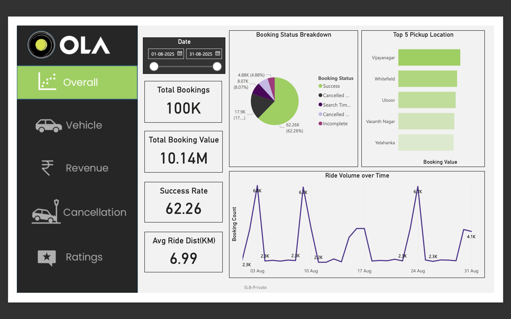
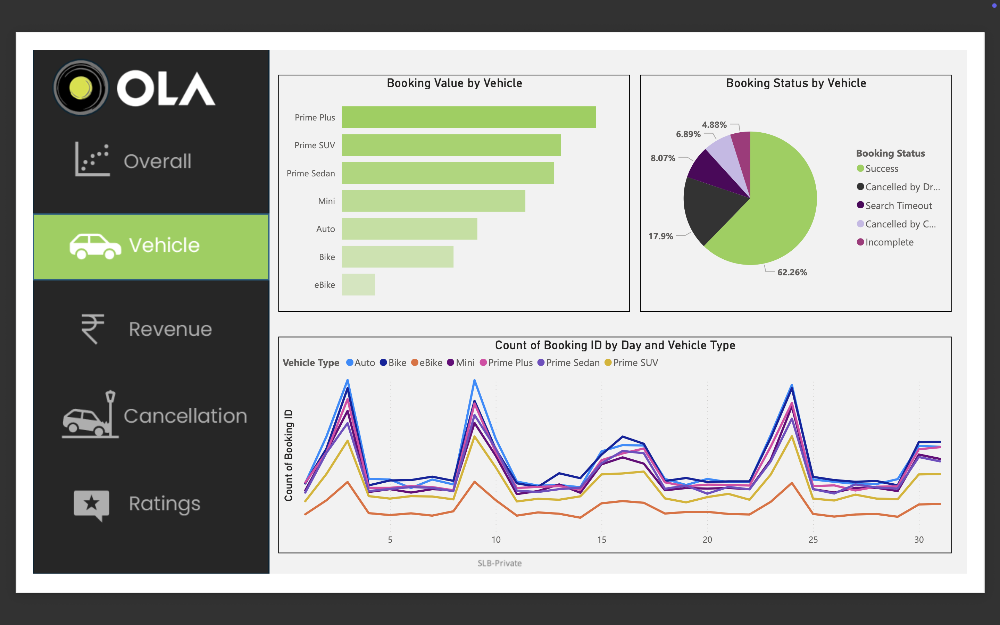
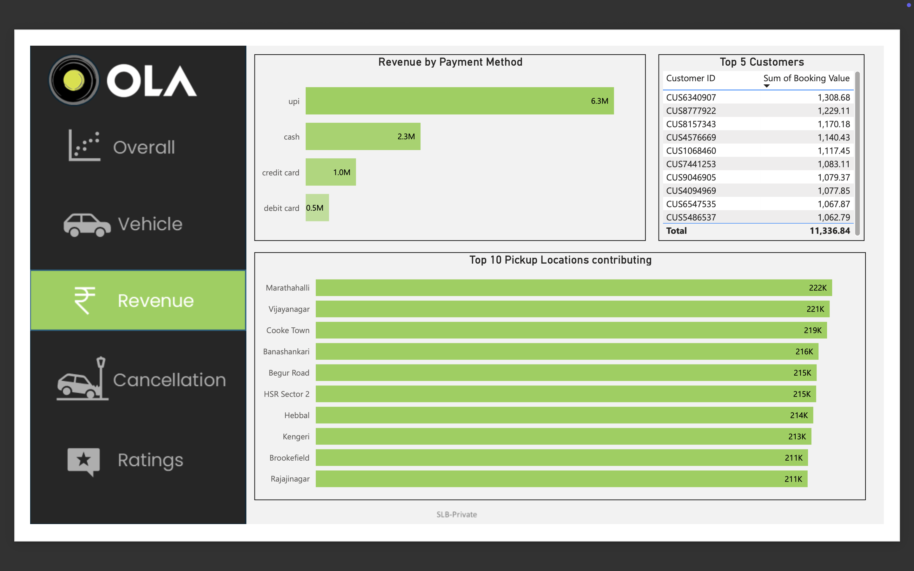
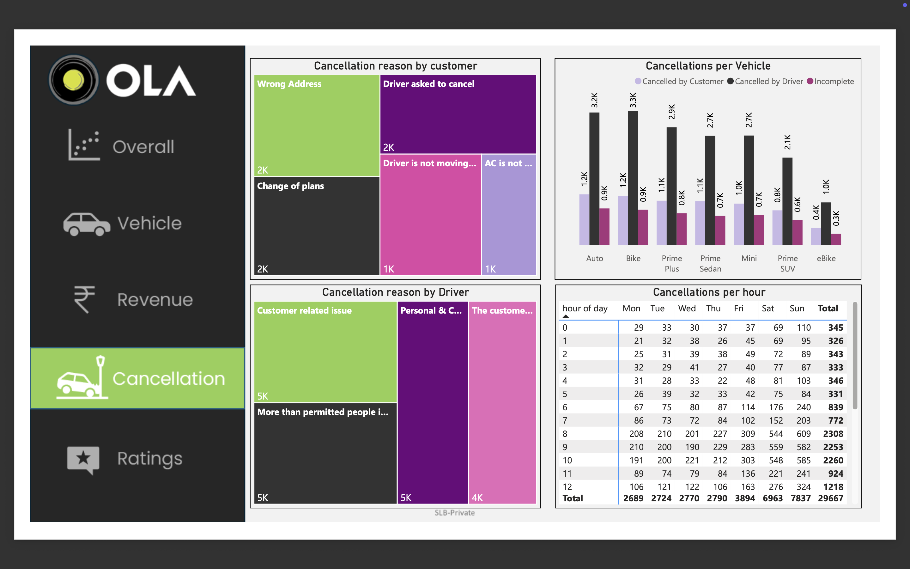
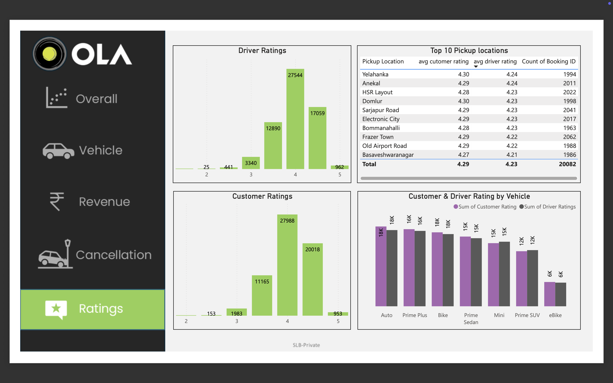

# Ola Ride Analysis - Power BI Dashboard

📊 An interactive **Power BI dashboard** analyzing Ola ride booking trends, cancellations, revenues, and customer insights.

---

## 🔎 Project Overview
This dashboard provides insights into ride bookings across different vehicle types and locations for Ola in August 2025.  
It highlights:
- Total bookings: **100K**
- Total booking value: **10.14M**
- Success rate: **62.26%**
- Average ride distance: **6.99 KM**
- Top pickup locations and high-value customers
- Revenue breakdown by payment methods
- Cancellation patterns by reason, vehicle, and time

---

## 📂 Files in this Repository
- `ola ride.pdf` → Exported dashboard report
- `OlaRideDashboard.pbix` → Power BI source file (if included)

---

## 🚀 Insights
- Prime Sedan and Prime SUV contribute the most to booking value.
- Most cancellations happen during morning peak hours (8–10 AM).
- UPI dominates payment methods with **6.3M revenue**.
- Vijayanagar, Whitefield, and Ulsoor are top pickup locations.

---

## 🛠️ Tools Used
- **SQL** for query analysis
- **Power BI Desktop**
- **Excel** (data preprocessing)
- **DAX** for calculated measures

---

## 📌 How to Use
1. Download the `.pbix` file
2. Open it in Power BI Desktop.
3. Explore interactive dashboards with slicers & filters.

---

## 📷 Preview

*(Add a screenshot of your dashboard here for quick viewing.)*
